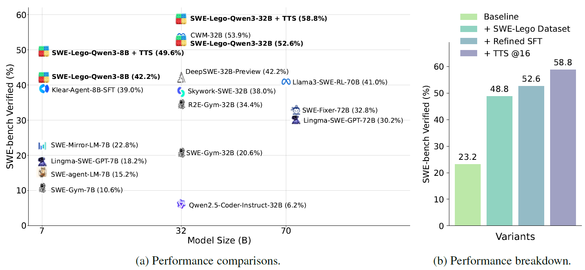

<h1 align="center"> SWE-Lego: Pushing the Limits of Supervised Fine-tuning for Software Issue Resolving </h1>

<!-- paper . data and models . project page -->
<p align="center">
<a href="https://pretty-radio-b75.notion.site/DeepSWE-Training-a-Fully-Open-sourced-State-of-the-Art[…]-by-Scaling-RL-22281902c1468193aabbe9a8c59bbe33?pvs=73">📃 Blog Post</a>
•
<a href="https://huggingface.co/SWE-Lego" > 🤗 HF Dataset </a>
•
<a href="https://huggingface.co/SWE-Lego" > 🤗 SWE-Lego-Qwen3-8B/32B</a>
<!-- •
<a href="https://agentica-project.com/" > 🌐 Project Page</a> -->
•
<a href="https://github.com/SWE-Lego/SWE-Lego" > 🧑‍💻 Code</a>
</p>

<div align="center">

[](https://github.com/SWE-Lego/SWE-Lego)
[](https://huggingface.co/SWE-Lego)
<!-- [](https://www.agentica-project.com) 
[](https://x.com/Agentica_) -->

</div>

<p align="center">
    <br>
    
    <br>
</p>

We present **SWE-Lego**, a supervised fine-tuning (SFT) recipe designed to achieve state-of-the-art performance in software engineering (SWE) issue resolving. SWE-Lego comprises three core building blocks:
- the **SWE-Lego dataset**, a collection of _32k_ highquality task instances and _18k_ validated trajectories, combining real and synthetic data to complement each other in both quality and quantity;
- a **refined SFT** procedure with error masking and a difficulty-based curriculum, which demonstrably improves action quality and overall performance;
- a **well-trained verifier** for improving test-time scaling (TTS).

Our fine-tuned models, SWE-Lego-Qwen3-8B and SWE-Lego-Qwen3-32B, are trained exclusively with SFT from Qwen3-8B/32B. Their effectiveness is demonstrated on SWE-Bench-Verified: the 8B variant achieves a Pass@1 of **42.2%** and TTS@16 of **49.6%**, and the 32B variant achieves a Pass@1 of **52.6%** and TTS@16 of **58.8%**.

We’ve open-sourced everything—our dataset, code, and training scripts, for everyone to progress on scaling and improving software engineering agents.


## Reproduction Guide 🎯

### 1. 📦 Installation

```bash
git clone https://github.com/SWE-Lego/SWE-Lego.git
```

#### 1.1 Installing vllm environment
```bash
conda create -n vllm python=3.12 -y
conda activate vllm
pip install vllm
```

#### 1.2 Installing openhands environment
```bash
cd SWE-Lego-V1/OpenHands-0.53.0
conda create -n openhands python=3.12 -y
conda activate openhands
conda install -c conda-forge nodejs=24.4.1 
conda install -c conda-forge poetry=2.1.4
pip install python-dateutil==2.9.0.post0
poetry run pip install datasets
make build
```

#### 1.3 Installing swebench environment
```bash
cd SWE-Lego-V1/SWE-bench-4.0.4
conda create -n swebench python=3.12 -y
conda activate swebench
pip install -e .
```

#### 1.4 Installing llamafactory environment
```bash
cd SWE-Lego-V1/LLaMA-Factory-0.9.4.dev0
conda create -n lf python=3.12 -y
conda activate lf

pip install torch==2.8.0 torchvision==0.23.0 torchaudio==2.8.0 --index-url https://download.pytorch.org/whl/cu128
pip install -e ".[torch,metrics,deepspeed,liger-kernel]" --no-build-isolation

# install flash-attn
wget https://github.com/Dao-AILab/flash-attention/releases/download/v2.8.3/flash_attn-2.8.3+cu12torch2.8cxx11abiFALSE-cp312-cp312-linux_x86_64.whl
pip install flash_attn-2.8.3+cu12torch2.8cxx11abiFALSE-cp312-cp312-linux_x86_64.whl

pip install wandb
```

### 🤖 2.  Inference and Evaluation of SWE-Lego-Qwen3-8B/32B

We take the SWE-Lego-Qwen3-32B for an example.

#### 2.1 Serving the model via vllm
```bash
bash scripts/swe_lego_qwen3_32b/serve_vllm.sh
```

#### 2.2 Running inference via openhands
```bash
bash scripts/swe_lego_qwen3_32b/infer.sh
```

#### 2.3 Running evaluation via swebench
```bash
bash scripts/swe_lego_qwen3_32b/eval.sh
```

### 🔥 3. Training of SWE-Lego-Qwen3-8B/32B

#### 3.1 Downloading trajectories for SFT from Hugging Face
```bash
cd LLaMA-Factory-0.9.4.dev0/data
wget https://huggingface.co/datasets/SWE-Lego/SWE-Lego-Real-Data-Sample2k/blob/main/data/swe_lego_real_trajectories_sample2k.json
wget https://huggingface.co/datasets/SWE-Lego/SWE-Lego-Synthetic-Data-Sample2k/blob/main/data/swe_lego_synthetic_trajectories_sample2k.json
```

#### 3.2 Running SFT via llamafactory
```bash
bash scripts/swe_lego_qwen3_8b/sft.sh
bash scripts/swe_lego_qwen3_32b/sft.sh
```


## Citation 📝
Please cite our paper if you find the repo helpful in your work:
```bibtex
@inproceedings{swelego2025,
  title={SWE-Lego: Pushing the Limits of Supervised Fine-tuning for Software Issue Resolving},
  author={Chaofan Tao and Jierun Chen and Yuxin Jiang and Kaiqi Kou and Shaowei Wang and Ruoyu Wang and Xiaohui Li and Sidi Yang and Yiming Du and Jianbo Dai and Zhiming Mao and Xinyu Wang and Lifeng Shang and Haoli Bai},
  booktitle={Arxiv},
  year={2025}
}
```
